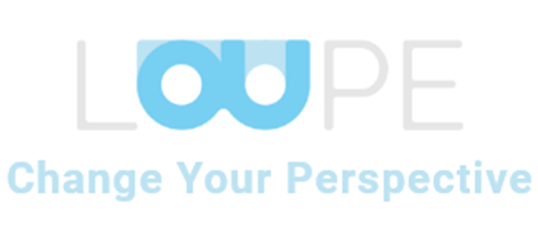

# Loupe Project
This project is a collaboration between Fontys ICT and Loupe PIT from ROC Tilburg. This is a project made to improve/support practical lessons with the use of Mixed Reality. At the time of writing this README the project mainly consists of a Portal. In this portal teachers can make lessons, groups with students, monitor what students do and give feedback to the actions that students did. In the Portal the teacher has a live view of the 3D object, the students are working on, this is done by implementing 3JS for rendering the 3D objects. All technologies chosen for this project were chosen by researching different available options. This project makes use of the microservice architecture, this architecture has been chosen by looking at the pro's- and cons of different architectures. For the main framework of this project .Net 6.0 is used. 
Every microservice has its own database. All of them except the Synchronization service make use of MsSQL databases. The Synchronization service makes use of MongoDB.
SignalR is used for messaging between the Synchronisation service and the Front-end React/Vite application.
GRPC is used for remote procedure calls betwen the Synchronisation- and Log Service.

## Table Of contents
* Loupe project
* Back-end 
* How to use the project	
* Feedback Service	
* Grouping Service
* Logging Service
* Synchronisation Service
* User Service
* Object Service
* Installation of the project	
* Front-end		
* Installation of the project
* Useful Sources	


# Back-end

## How to use the project
Because this project makes use of the microservice architecture the project is split into several components/services. 

### Feedback Service
The Feedback Service handles giving feedback to actions that users have performed. This is used by teachers in the portal to give feedback to specific actions that a student did.

### Grouping Service
The Grouping Service handles making groups of students. This is used by teachers in the portal, the teacher is able to add students to a group. After the students inside a group will be able to work on the same assignment.

### Logging Service
The Logging Service is responsible for logging all actions done to a object made by students. When te student makes a change to the object, which he/she is working on, it will be logged. 

### Synchronisation Service
The Synchronisation Service makes sure that all clients are kept in sync. The Synchronisation Service uses the logs, made by performing actions to an object, and makes sure everyone sees, and works with the same object, containing the same transformations.

### User Service
The User Service is responsible for all user data and actions (CRUD).

### Object Service
The Object Service is still a work in progress. Ultimately the Object Service should be used for uploading and managing the different 3D objects that will be used for lessons/assignments.

## Installation of the project
To fully use this project, all services need to be running.
To start working with this project:
- Clone the repository to your device
- Open the repository with your IDE of choice.
- Start by routing into the correct repository.
```console
cd .\Docker_compose\
```
- Proceed to launch the containers using the images on the LOUPE container registry
```console
docker-compose up -d
```
- Note that the -d is optional and will run the containers in detached mode. [More Info](https://docs.docker.com/language/golang/run-containers/#:~:text=Run%20in%20detached%20mode&text=Docker%20can%20run%20your%20container,you%20to%20the%20terminal%20prompt.)

# Front-end
## Installation of the project
To start working with this project:
- Install node version .... [link](https://nodejs.org/en)
- Clone the repository to your device
- Open the repository with your IDE of choice.
- Start by installing necessary packages.
```console
npm install
```
- Run the application from the LOUPE_Frontend folder
```console
npm run dev
```

## Useful Sources
[How to create a minimal api microservice](https://www.youtube.com/watch?v=Z4bINJudHX8&list=PL6tu16kXT9PrlCX-b1o0WdBc56rXHJXLy)

[Mega directory to all project related documents](https://mega.nz/fm/poAQnJhZ)

[See the Trello board for open issues](https://trello.com/b/RDldlSvD/loupe-back-end)
